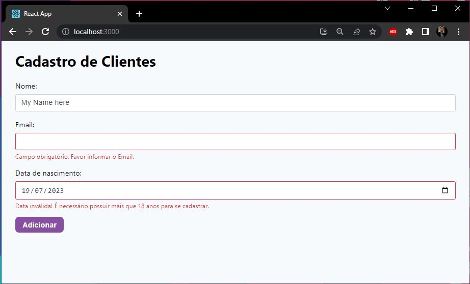
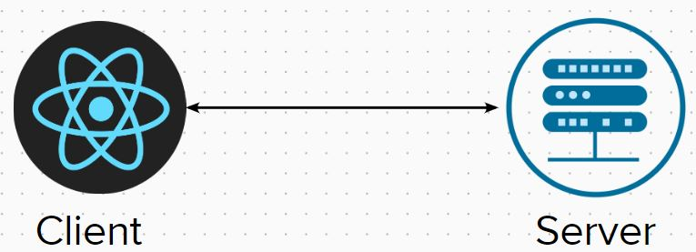

# React Form Validate Application

This application implements various types of form validations and demonstrates how to manage form events efficiently using "Formik." It also utilizes "Yup" integrated with "Formik" for robust validation schemes. The files are componentized to avoid code repetition and improve code readability following clean code principles.

## About

In any system, there are validations both on the client-side and the server-side. In this application, we ensure that the information, which would potentially be sent to the server, complies with our requirements, preventing requests with invalid data.

## Accessing the Application

In this application, you can fill out the fields "name," "email," and "date of birth." Each field is thoroughly validated, and if it does not meet the expected format, an error message is displayed to alert the user to correct the input.

## How to Run

Follow these steps to run the application locally:

1. Clone the repository;
2. Navigate to the project folder: `cd repository`
3. Install dependencies: `npm install`
4. Run the development server: `npm start`
5. Open your web browser and access the application at `http://localhost:3000`

Feel free to explore the code and customize it according to your needs. If you encounter any issues or have suggestions for improvement, please contact me !

Happy coding!

